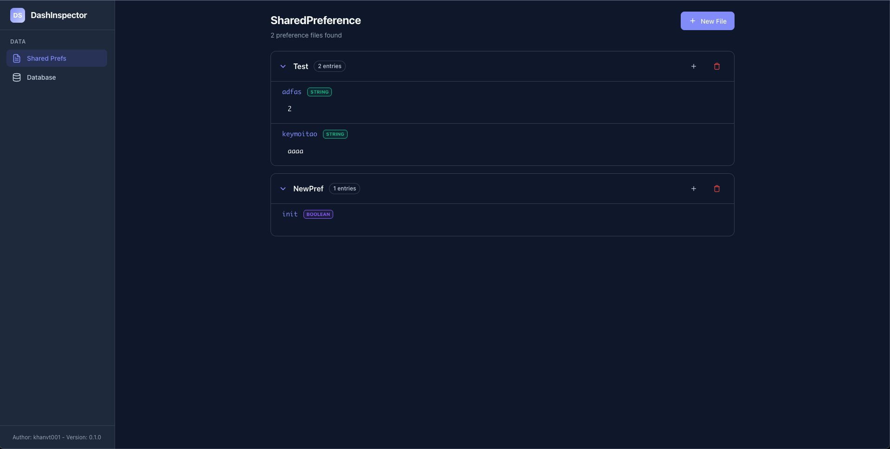
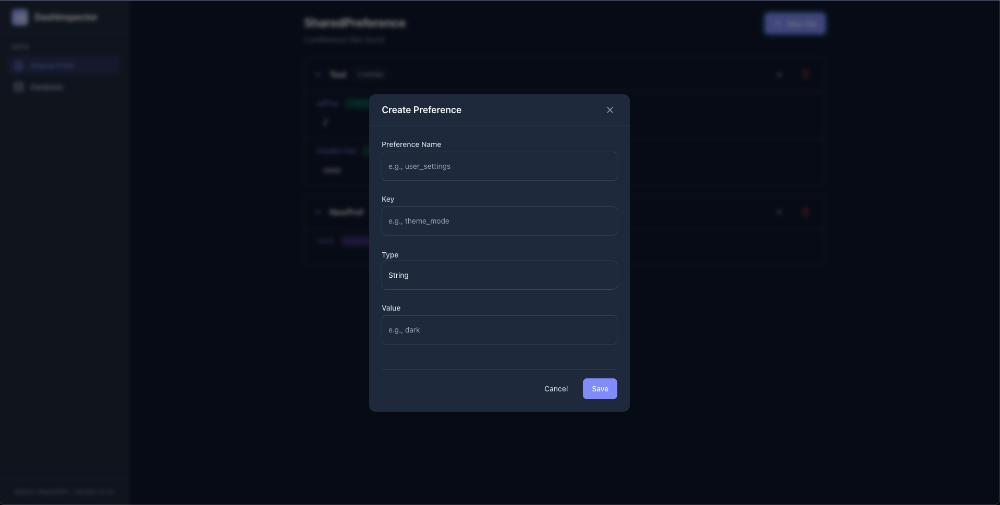
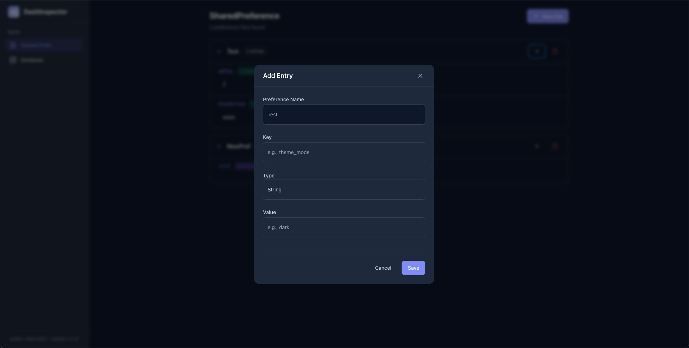

# DashInspector

A lightweight runtime debugging library for Android that provides a web-based interface to inspect and modify SharedPreferences and databases during development.

## Features

- **SharedPreferences Inspector**: View, create, update, and delete SharedPreference entries in real-time
- **Web-based UI**: Access the inspector through any browser on your development machine
- **Zero Configuration**: Simple one-line initialization
- **Lightweight**: Minimal impact on app performance
- **Type Support**: Full support for all SharedPreferences data types (String, Int, Long, Float, Boolean, StringSet)

## Screenshots







## Installation

### Gradle (Groovy)

```groovy
dependencies {
    debugImplementation 'com.github.khanvt001:dashinspector:1.0.0'
}
```

### Gradle (Kotlin DSL)

```kotlin
dependencies {
    debugImplementation("com.github.khanvt001:dashinspector:1.0.0")
}
```

### JitPack

Add JitPack repository to your root `build.gradle` or `settings.gradle`:

```groovy
// settings.gradle
dependencyResolutionManagement {
    repositories {
        maven { url 'https://jitpack.io' }
    }
}
```

Then add the dependency:

```groovy
dependencies {
    debugImplementation 'com.github.khanvt001:dashinspector:1.0.0'
}
```

## Quick Start

### 1. Initialize in your Application class

```kotlin
class MyApplication : Application() {
    override fun onCreate() {
        super.onCreate()

        // Initialize DashInspector (debug builds only recommended)
        if (BuildConfig.DEBUG) {
            DashInspector.init(this)
        }
    }
}
```

### 2. Set up ADB port forwarding

Run this command in your terminal to forward the port:

```bash
adb forward tcp:8080 tcp:8080
```

### 3. Access the web interface

Open your browser and navigate to:

```
http://localhost:8080
```

## Configuration

### Custom Port

You can specify a custom port during initialization:

```kotlin
DashInspector.init(this, port = 9090)
```

Then update your ADB forwarding command:

```bash
adb forward tcp:9090 tcp:9090
```

### Lifecycle Management

```kotlin
// Check if server is running
val isRunning = DashInspector.isRunning()

// Get current port
val port = DashInspector.getPort()

// Stop the server
DashInspector.stop()
```

## Java Support

DashInspector is fully compatible with Java:

```java
public class MyApplication extends Application {
    @Override
    public void onCreate() {
        super.onCreate();

        if (BuildConfig.DEBUG) {
            DashInspector.init(this);
            // or with custom port
            DashInspector.init(this, 9090);
        }
    }
}
```

## API Reference

### SharedPreferences Endpoints

| Method | Endpoint | Description |
|--------|----------|-------------|
| GET | `/api/preferences` | List all SharedPreferences files and entries |
| POST | `/api/preferences/create` | Create a new SharedPreference file with an entry |
| POST | `/api/preferences/entry/add` | Add an entry to an existing preference file |
| POST | `/api/preferences/entry/update` | Update an existing entry |
| POST | `/api/preferences/entry/remove` | Remove a specific entry |
| POST | `/api/preferences/remove` | Delete an entire preference file |

### Supported Data Types

- `String`
- `Int` / `Integer`
- `Long`
- `Float`
- `Boolean`
- `StringSet`

## Requirements

- **Min SDK**: 24 (Android 7.0)
- **Target SDK**: 36
- **Java**: 11+

## Dependencies

DashInspector uses the following libraries:

- [NanoHTTPD](https://github.com/NanoHttpd/nanohttpd) - Lightweight HTTP server
- [Gson](https://github.com/google/gson) - JSON serialization

## Security Considerations

**Important**: DashInspector is intended for development and debugging purposes only. It provides full read/write access to your app's SharedPreferences.

Recommendations:
- Only include DashInspector in debug builds using `debugImplementation`
- Never ship DashInspector in production builds
- The server only listens on localhost and requires ADB port forwarding

## Troubleshooting

### Port already in use

If the port is already in use, kill the existing process:

```bash
kill -9 $(lsof -ti :8080)
adb forward tcp:8080 tcp:8080
```

### Cannot connect to server

1. Ensure the app is running on your device/emulator
2. Check that ADB port forwarding is set up correctly
3. Verify the correct port is being used
4. Check logcat for DashInspector startup messages

### Multiple devices connected

Specify the device when setting up port forwarding:

```bash
adb -s <device-serial> forward tcp:8080 tcp:8080
```

## Roadmap

- [ ] Database Inspector (SQLite, Room)
- [ ] Network request inspection
- [ ] File system browser
- [ ] Export/Import preferences

## License

This project is licensed under the MIT License - see the [LICENSE](LICENSE) file for details.

## Contributing

Contributions are welcome! Please feel free to submit a Pull Request.
